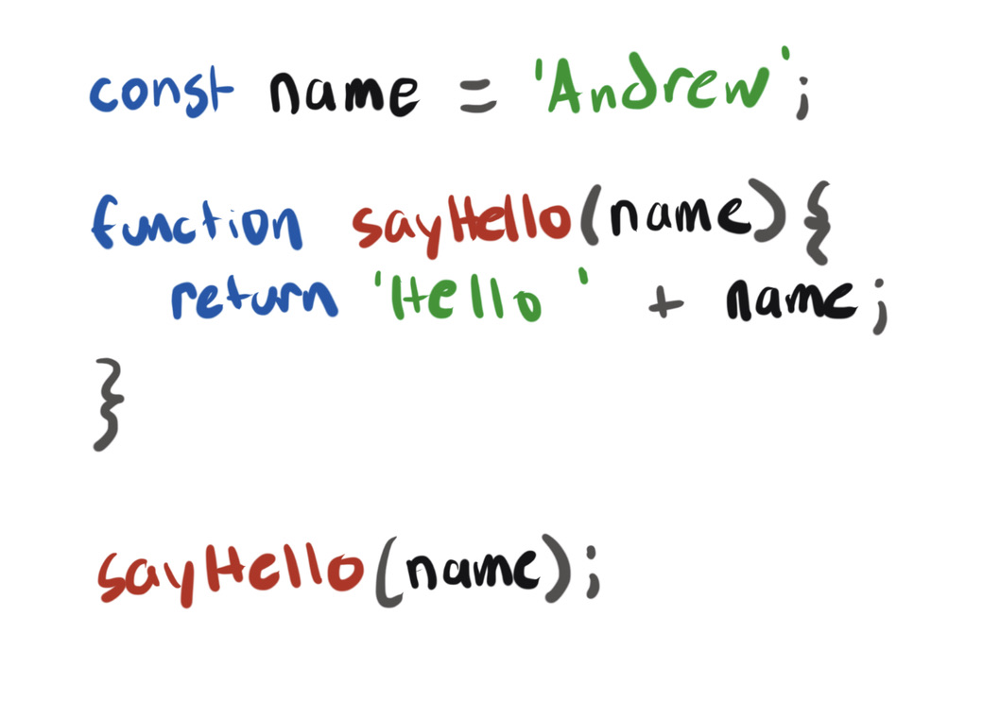
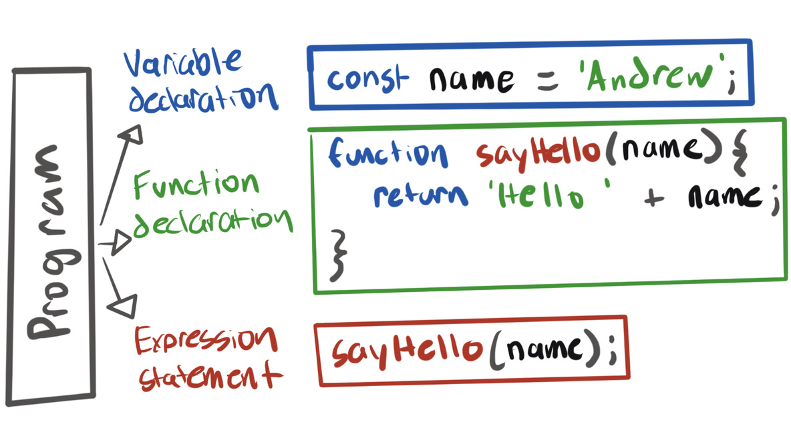
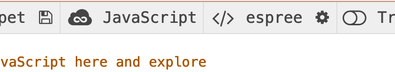
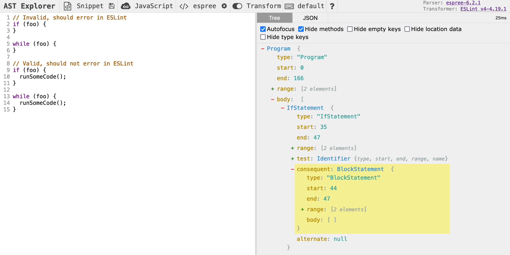
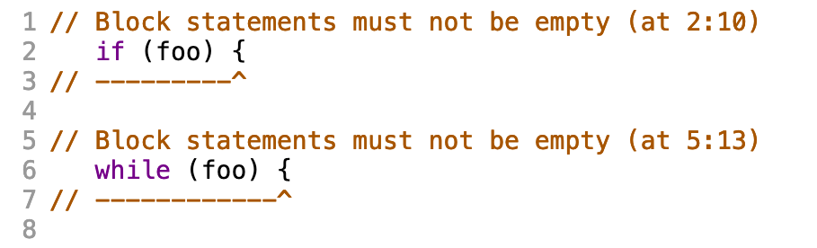

import {Banner} from '../components/Banner';

Abstract Syntax Tree (AST) has always been one of those scary computer science-y terms that I have found intimidating. I recently had the chance to dig into ASTs at work while making a new ESLint rule, and it turns out that they are not so difficult to understand after all. In this article I'll provide some background info about ASTs, and how javascript developers can use them to make things like ESLint rules and Babel plugins.

An AST is a tree-like data structure that represents code written in any programming language. This tree like structure contains **nodes** that represent variables, functions, and expressions. If we think of the code we write as _code for humans_, we can think of an AST as _code for computers_. ASTs can be used to programatically check, correct, transform, and compile our code. They are used in just about every computer application, including the browser you are reading this in!

<Banner status="info">
  <p>
    It is called <i>abstract</i> because there are also <i>concrete</i> syntax
    trees. For the purpose of this article all we need to know is that abstract
    syntax trees are less verbose than their concrete counterparts, while still
    containing enough information to fully represent our code in a tree. If
    you'd like to learn more about the difference between concrete and abstract
    syntax trees, I found{' '}
    <a href="https://medium.com/basecs/leveling-up-ones-parsing-game-with-asts-d7a6fc2400ff">
      this article
    </a>{' '}
    very helpful.
  </p>
</Banner>

To turn code into an AST, it needs to be run through a **parser**. There are many Javascript parsers available, and some applications will even build in their own.

A Javascript AST is basically a big object filled with keys and values that represent all the different parts of our code. Think of it as a tree that starts with the top level scope of your code, then branches out into the variables and functions you write. Each of these branches is called a `node`.

Lets use the Javascript code below as an example:



After running the above code through a parser to make an AST, the first few branches of the code would look something like this:



Each box represents a **node** in the tree, and each node has its own **type**. The top level scope node is of type **Program**. In the diagram above, we can see that the Program node branches out into three parts, a **Variable Declaration,** a **Function Declaration,** and an **Expression Statement**. Each of these three nodes have their own child nodes that break code down into smaller parts.

## AST Explorer

The thing that really made this all click for me was playing around with a tool called [AST Explorer](https://astexplorer.net/). The tool lets you select a language and parser, paste in some code, and see the AST that is output after running the code through the parser.

If you haven't used it before, I recommend playing around with it before continuing to the next section. Be sure to set `Javascript` as the language, and for this article we'll use `espree` (the default ESLint parser) as the parser. Both toggles are at the top of the page.



If you click on part of the code on the left, the corresponding node will be highlighted in the AST on the right. Here is the code from our example above, try pasting it into AST explorer and testing it out. You'll find the same nodes in the diagram above.

```javascript
const name = 'Andrew';

function sayHello(name) {
  return 'hello ' + name;
}

sayHello(name);
```

### Cool, how is this useful?

Now that we know that an AST is a tree-like representation of our code that is easier for computers to work with, how can we use it to our advantage as developers?

[Babel](https://babeljs.io/) is a great example of a developer tool that uses AST's. Babel is often used to allow developers to write next generation Javascript and compile it back to a more widely supported version to run in the browser. For example, using Babel we could take advantage of a new feature like [optional chaining](https://developer.mozilla.org/en-US/docs/Web/JavaScript/Reference/Operators/Optional_chaining), while still supporting older browsers that do not support the feature.

Babel does this by turning the code you write into an AST, running the AST through a series of [plugins](https://babeljs.io/docs/en/plugins/) that can make changes to the AST, and then turning the AST with changes back into standard Javascript code.

Babel is often one of the tools used to turn JSX syntax that we write into valid Javascript syntax that can run in the browser.

```jsx
<MyComponent />;

// Turns into:
React.createElement(MyComponent);
```

But this post isn't about Babel plugins, so let's turn our focus to ESLint!

## ESLint rules

[ESLint](https://eslint.org/) is a tool that analyzes your code to find issues before they hit production. ESLint is built into most code editors, so you can see any errors that come up as you write your code.

As you might have guessed, ESLint uses an AST to analyze your code piece by piece. The AST is run through a series of [rules](https://eslint.org/docs/user-guide/configuring/rules) that check to ensure syntax is correct and best practices are followed.

ESLint comes with many rules built-in, and you can choose which ones you want to enable and disabled in your application. If the built-in rules are not enough, there is a rich community of custom rules available for download as NPM packages. If you find yourself needing a very specific rule, or can't find a suitable open source option, you can create your own custom rule.

### Building our own rule

For the rest of this article, we'll be rebuilding one of the built-in ESLint rules, [no-empty](https://eslint.org/docs/rules/no-empty). The rule ensures that developers do not leave empty block statements in their code.

In the AST Explorer, lets replace the example code we were using with the code below that we want to lint with our rule. We'll come back to this after learning a bit more about the structure of ESLint rules.

```jsx
// Invalid, should error in ESLint
if (foo) {
}

while (foo) {}

// Valid, should not error in ESLint
if (foo) {
  runSomeCode();
}

while (foo) {
  runSomeOtherCode();
}
```

### Anatomy of an ESLint rule

#### Files

There is a standard format for ESLint rules. Each rule haves three files:

- `lib/rules/rule-name.js` - The source file for the rule
- `tests/lib/rules/rule-name.test.js` - A test file
- `docs/rules/rule-name.md` - A documentation file

We will be focusing on the source file.

#### Source file

The source file for a lint rule exports an object that must contain two main properties:

- `meta` - An object containing information about the rule
- `create` - a function that contains the logic for linting your code.

The skeleton of our `no-empty` rule would like this:

```jsx
module.exports = {
  meta: {
    type: 'suggestion',
    docs: {
      description: 'disallow empty block statements',
      category: 'Possible Errors',
      recommended: true,
      url: 'linl-to-docks',
    },
    fixable: 'code',
    // Rule settings can be added here
    schema: [],
  },
  create: function(context) {
    return {
      // callback functions go here
    };
  },
};
```

#### Create function

The `create` function is where most of the the logic lives. It returns an object where each value is a callback function that ESLint runs on the different `node` types in the AST.

To fill in the `no-empty` rule, we need to find the node type of block statements in our code so that we can run a function to check if they are empty.

This is where AST Explorer really comes in handy. Let's open it up again, and click on one of the opening curly brackets (`{`) in the code we pasted in a couple minutes ago. The Explorer will highlight the block statement on the left, and we can see it is of type `BlockStatement`.



Now let's add a `BlockStatement` key to the object returned by the `create` function, and set the key's value to a function. ESLint will run this function once for each block statement in our code, and pass it the corresponding `node`, which is highlighted in the screenshot above.

```jsx
create: function(context) {
	return {
		// the `node` is a BlockStatement object
		BlockStatement: (node) => {
			// The linter will run this function once for each
			// block statement in your code
		},
	};
}
```

## Building rules in AST Explorer

AST Explorer has another great feature that lets you build and test rules right inside your browser. At the top of AST Explorer you will notice another toggle for `Transform`. Lets set that to `ESLint v4`.

You'll notice two new sections come up from the bottom of the window. On the bottom left we can paste in our lint rule code, and on the bottom right you will see the output of our code.

Lets paste in what we have so far, I've added a `console.log` that logs the `node` in the `FunctionDeclaration` callback so we can see if our rule is working:

```jsx
module.exports = {
  meta: {
    type: 'suggestion',
    docs: {
      description: 'disallow empty block statements',
      category: 'Possible Errors',
      recommended: true,
      url: 'linl-to-docks',
    },
    fixable: 'code',
    // Rule settings can be added here
    schema: [],
  },
  create: function(context) {
    return {
      BlockStatement: node => {
        console.log(node);
      },
    };
  },
};
```

Open up your browser console and you should see the four `BlockStatement` objects that represent the four block statements in the code we are linting. Inside those objects you will find lots of information about node, including a `body`. We can use this `body` value to check if our block statements are empty.

Now we can fill in our `BlockStatement` function with a basic implementation of this rule:

```jsx
create: function (context) {
  return {
    BlockStatement: (node) => {
      // If the node body is empty, return
      if (node.body.length !== 0) {
        return;
      }

      context.report({
        node: node,
        message: "Block statements must not be empty"
      });
    },
  };
},
```

A couple important things to note here:

### Early returns

It is common to use _early returns_ when we know the node we are analyzing is valid. This implementation has only one check, but most rules will have multiple. If we make it through all the early return checks, we want to report an error.

### Context object

We are using the `context` object passed into the `create` function to report errors. The context object provides a number of helpful properties and methods that can be used to make more complex rules. The context object is [documented here](https://eslint.org/docs/developer-guide/working-with-rules#the-context-object).

#### See errors in AST Explorer

After updating our lint rule in AST Explorer, we can now see errors reported on the two empty block statements, but not on the statements with content. It works!



### Making our rule better

Our implementation of `no-empty` is very basic, and the real implementation provides a bit more flexibility. Now that we have learned the basics of ASTs and ESLint rules, see if you can extend the rule we have so far to support these edge cases:

- Do not report if the block statement only contains comments
- Do not report if the block statement parent is a function (empty functions are generally allowed)
- This one is trickier. See if our can get the rule to report on empty `switch` statements

**Hint:** Use the AST explorer to find the the data you need implement these additions to the rule.

### Thats all!

If you made it this far, thanks so much for reading! I'd love to [connect on twitter](https://twitter.com/andrew_mcgov) to talk Javascript, and hear what you thought about the article.
